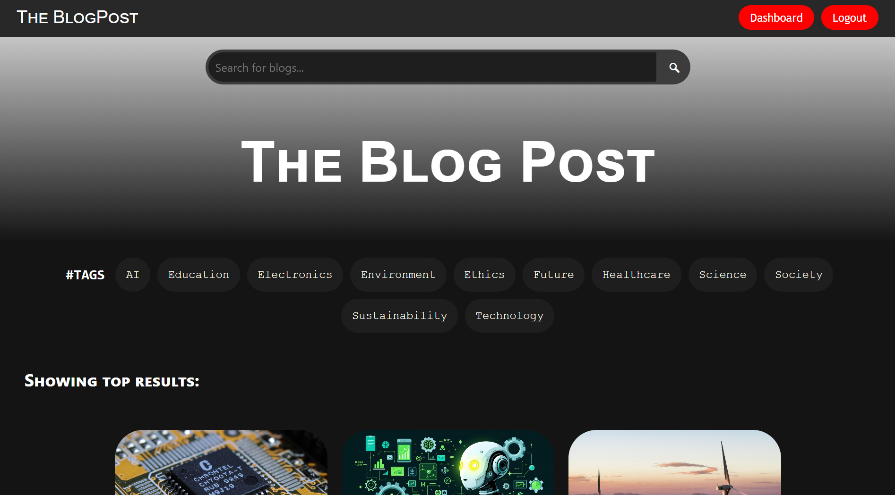

# The BlogPost 📝

A dynamic and full-featured blog platform built with Flask. The BlogPost allows writers to share their ideas with the world, and readers to discover, search, and engage with content seamlessly.



**[Live deployment](https://theblogpost.pythonanywhere.com/)**

---


## About The Project

The BlogPost is a robust web application designed to provide a complete blogging experience. It serves as an excellent portfolio piece demonstrating proficiency in backend development with Flask, database management with SQLite, and frontend integration using the Jinja templating engine. The project emphasizes secure user authentication, role-based access control, and a clean, responsive user interface.

---

## Key Features

### For Readers 📖

-   **Browse & Discover**: View all blog posts in a clean, paginated feed.
-   **Powerful Search**: Instantly find blogs by searching for keywords in titles or content.
-   **Tag Filtering**: Click on a tag to see all related posts, making topic discovery easy.
-   **Engage with Comments**: Read and leave comments on blog posts to join the conversation.
-   **Responsive Design**: Seamless experience on any device, from desktops to smartphones.

### For Writers ✍️

-   **User Authentication**: Secure signup and login system to protect your account.
-   **Full Post Management**: Create, edit, and delete your own blog posts with an intuitive editor.
-   **Image Support**: Embed images in your posts to make them more engaging.
-   **Comment Moderation**: Delete any comments left on your own blog posts.

### For Administrators 👑

-   **Admin Dashboard**: A central hub for site management.
-   **User Management**: View all registered users, promote standard users to admins, demote admins, and delete user accounts.
-   **Content Moderation**: Edit or delete *any* blog post on the platform.
-   **Comment Control**: Delete *any* comment on *any* blog post.

---

## Tech Stack


-   **Backend**: [Python](https://www.python.org/) with [Flask](https://flask.palletsprojects.com/)
-   **Frontend**: HTML5, CSS3, JavaScript
-   **Templating Engine**: [Jinja2](https://jinja.palletsprojects.com/)
-   **Database**: [SQLite](https://www.sqlite.org/index.html)
-   **Authentication**: [Flask-Login](https://flask-login.readthedocs.io/)
-   **Password Security**: [Werkzeug](https://werkzeug.palletsprojects.com/) for password hashing

---


### Prerequisites

Make sure you have Python 3 and pip installed on your system.
-   **Python 3.x**
-   **pip** (Python package installer)
-   **git** (for cloning the repository)

### Installation & Setup

1.  **Clone the Repository**
    ```bash
    git clone [https://github.com/shresth3904/The_blogPost.git](https://github.com/shresth3904/The_blogPost.git)
    cd The_blogPost
    ```

2.  **Install Required Dependencies**
    ```bash
    pip install -r requirements.txt
    ```

3.  **Run the Application**
    The application will create the `database.db` file automatically on the first run.
    ```bash
    flask run
    ```
    Your application should now be running at `http://127.0.0.1:5000/`.

---

## Usage

Once the application is running, you can navigate to `http://127.0.0.1:5000/` in your web browser.

-   You can register a new user account or use the demo admin account to test administrative features.

### Demo Admin Credentials

-   **Username**: `admin`
-   **Password**: `password`

---


## Contact

Shresth - [LinkedIn](https://www.linkedin.com/in/shresth-65ab02304/) - shresth3904@gmail.com

Project Link: [https://github.com/shresth3904/The_blogPost](https://github.com/shresth3904/The_blogPost)
